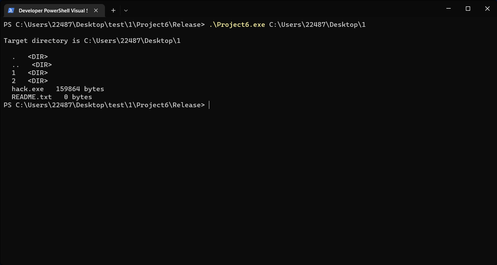
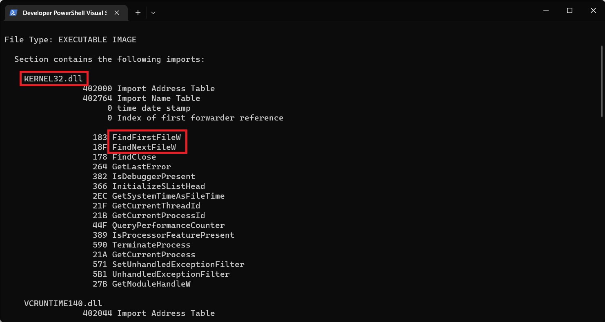
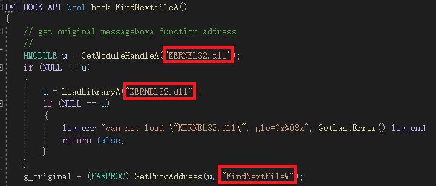
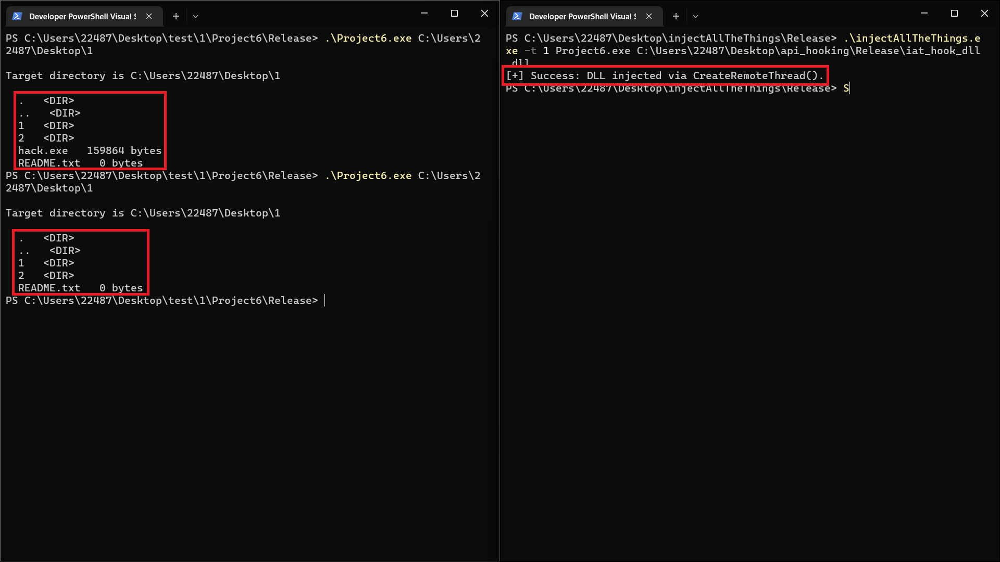
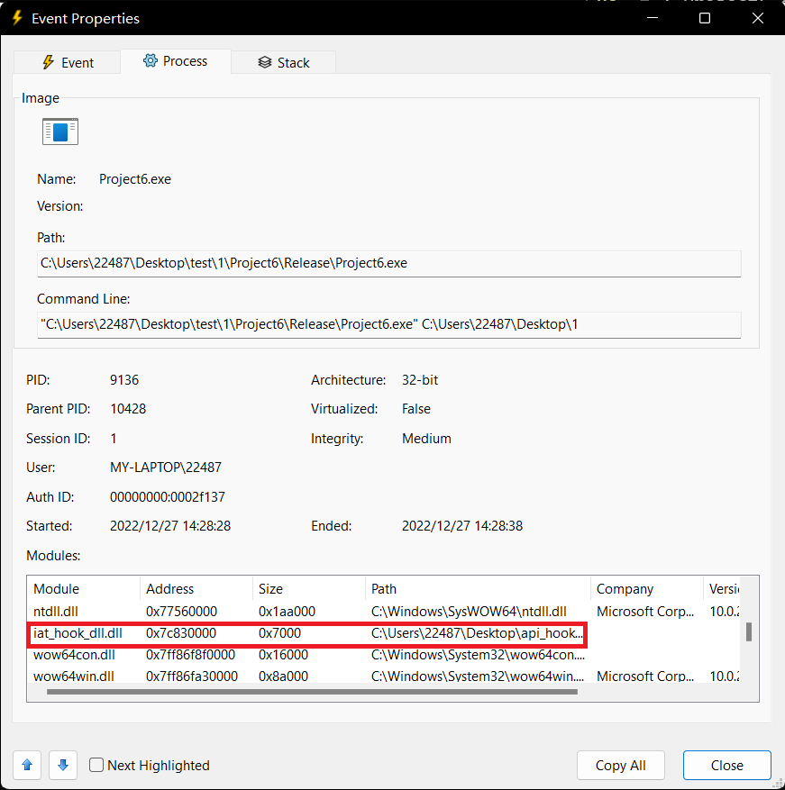

## API HOOK

### 实验要求

* 通过hook FindNextFile函数，实现对cmd程序中的dir功能无法查看到hack.exe。

* 提示：

  1. 可以将任意一个exe文件重命名为hack.exe

  2. 系统自带的cmd程序是64位，所以注入的dll也需要编译为64位，否则会加载不成功。如果想使用32程序实验，可以自行编译遍历目录的[示例代码](https://learn.microsoft.com/zh-cn/windows/win32/fileio/listing-the-files-in-a-directory)，然后对示例代码编译所得的exe进行hook。

### 实验环境

* windows 11
* Vistual Studio

### 实验过程

首先将遍历目录的[示例代码](https://learn.microsoft.com/zh-cn/windows/win32/fileio/listing-the-files-in-a-directory)的编译运行，因为微软的示例代码中有一些字符串的报错，所以我们直接将其删去，不影响程序原本的功能，代码如下:

```c++
#include <windows.h>
#include <tchar.h> 
#include <stdio.h>
#include <strsafe.h>
#pragma comment(lib, "User32.lib")

void DisplayErrorBox(LPTSTR lpszFunction);

int _tmain(int argc, TCHAR* argv[])
{
    WIN32_FIND_DATA ffd;
    LARGE_INTEGER filesize;
    TCHAR szDir[MAX_PATH];
    size_t length_of_arg;
    HANDLE hFind = INVALID_HANDLE_VALUE;
    DWORD dwError = 0;

    // If the directory is not specified as a command-line argument,
    // print usage.

    

    if (argc != 2)
    {
        _tprintf(TEXT("\nUsage: %s <directory name>\n"), argv[0]);
        return (-1);
    }

    // Check that the input path plus 3 is not longer than MAX_PATH.
    // Three characters are for the "\*" plus NULL appended below.

    StringCchLength(argv[1], MAX_PATH, &length_of_arg);

    if (length_of_arg > (MAX_PATH - 3))
    {
        _tprintf(TEXT("\nDirectory path is too long.\n"));
        return (-1);
    }

    _tprintf(TEXT("\nTarget directory is %s\n\n"), argv[1]);

    // Prepare string for use with FindFile functions.  First, copy the
    // string to a buffer, then append '\*' to the directory name.

    StringCchCopy(szDir, MAX_PATH, argv[1]);
    StringCchCat(szDir, MAX_PATH, TEXT("\\*"));

    // Find the first file in the directory.

    hFind = FindFirstFile(szDir, &ffd);

    if (INVALID_HANDLE_VALUE == hFind)
    {
        // DisplayErrorBox(TEXT("FindFirstFile"));
        return dwError;
    }

    // List all the files in the directory with some info about them.

    //Sleep(10000);
    do
    {
        if (ffd.dwFileAttributes & FILE_ATTRIBUTE_DIRECTORY)
        {
            _tprintf(TEXT("  %s   <DIR>\n"), ffd.cFileName);
        }
        else
        {
            filesize.LowPart = ffd.nFileSizeLow;
            filesize.HighPart = ffd.nFileSizeHigh;
            _tprintf(TEXT("  %s   %ld bytes\n"), ffd.cFileName, filesize.QuadPart);
        }
    } while (FindNextFile(hFind, &ffd) != 0);

    dwError = GetLastError();
    if (dwError != ERROR_NO_MORE_FILES)
    {
        // DisplayErrorBox(TEXT("FindFirstFile"));
        return 0;
    }

    FindClose(hFind);
    return dwError;
}
```



我们看一下该程序导入了哪些表，使用命令

```bash
dumpbin /imports Project6.exe
```



我们可以发现该程序调用了`KERNEL32.dll`中的`FindFirstFile`和`FindNextFile`的函数，那我们接下来重点看一下`FindNextFile`函数的原理，首先调用`FindFirstFile`得到第一个文件的句柄，然后传给`FindNextFile`。`FindNextFile`根据这个句柄再去找下一个文件，直到当前文件夹下没有文件为止。如果函数成功，则返回值为非零值，如果函数失败，则返回值为零。

那如何实现隐藏文件呢？其实我们只需要在里面加一个判断，如果当前的文件是我们要隐藏的文件，那么就再执行一次`FindNextFile`函数，这样就可以相当于跳过了要隐藏的文件，进而就实现了对其的隐藏。

我们查阅官方文档知道了，`FindNextFile`函数有两个参数，

```C++
BOOL FindNextFileA(
  [in]  HANDLE             hFindFile,
  [out] LPWIN32_FIND_DATAA lpFindFileData
);
```

`hFindFile`为前一次调用 [FindFirstFile](https://learn.microsoft.com/zh-cn/windows/desktop/api/fileapi/nf-fileapi-findfirstfilea) 或 [FindFirstFileEx](https://learn.microsoft.com/zh-cn/windows/desktop/api/fileapi/nf-fileapi-findfirstfileexa) 函数返回的搜索句柄。

`lpFindFileData`指向 [WIN32_FIND_DATA结构的指针](https://learn.microsoft.com/zh-cn/windows/desktop/api/minwinbase/ns-minwinbase-win32_find_dataa) ，该结构接收有关找到的文件或子目录的信息。

那我们编写的`hooked_FindNextFileA`函数也应当有这两个参数，其实就是在`hooked_FindNextFileA`函数中调用了真正的`FindNextFile`函数，如果当前的文件是我们要隐藏的文件，那么就再执行一次`FindNextFile`函数，具体代码如下：

```c++
bool
__stdcall 
hooked_FindNextFileA(
    HANDLE hFindFile,
    LPWIN32_FIND_DATAW lpFindFileData
	)
{
	if (NULL != g_original)
	{
        fnFindNextFileA fn = (fnFindNextFileA) g_original;
        char* CStr = "hack.exe";
        wchar_t* WStr;
        size_t len = strlen(CStr) + 1;
        size_t converted = 0;
        WStr = (wchar_t*)malloc(len * sizeof(wchar_t));
        mbstowcs_s(&converted, WStr, len, CStr, _TRUNCATE);
        bool tf = fn(hFindFile, lpFindFileData);
        if (0==wcscmp((*lpFindFileData).cFileName, WStr))
        {
            tf = fn(hFindFile,lpFindFileData);
        }
        return tf;
	}
    return false;
}
```

宽字符类型和`char`类型不能直接比较，文件名比较过程中，我们拿到的是`wchar`类型的文件名，因此要定义一个`wchar`类型的文件名和当前文件名比较。所以我们采用了`char`转`wchar_t`的方式。

接着我们需要修改老师所给的代码，



类似的地方都要进行修改，在这里就不一一展示了，修改之后我们成功编译，然后通过`injectAllTheThings.exe`将我们所写的`dll`注入到`Project6.exe`中，就可以实现隐藏文件的功能了。



我们使用`processmointor`查看，



我们编写的iat_hook_dll.dll确实已经被注入到该程序中。 
