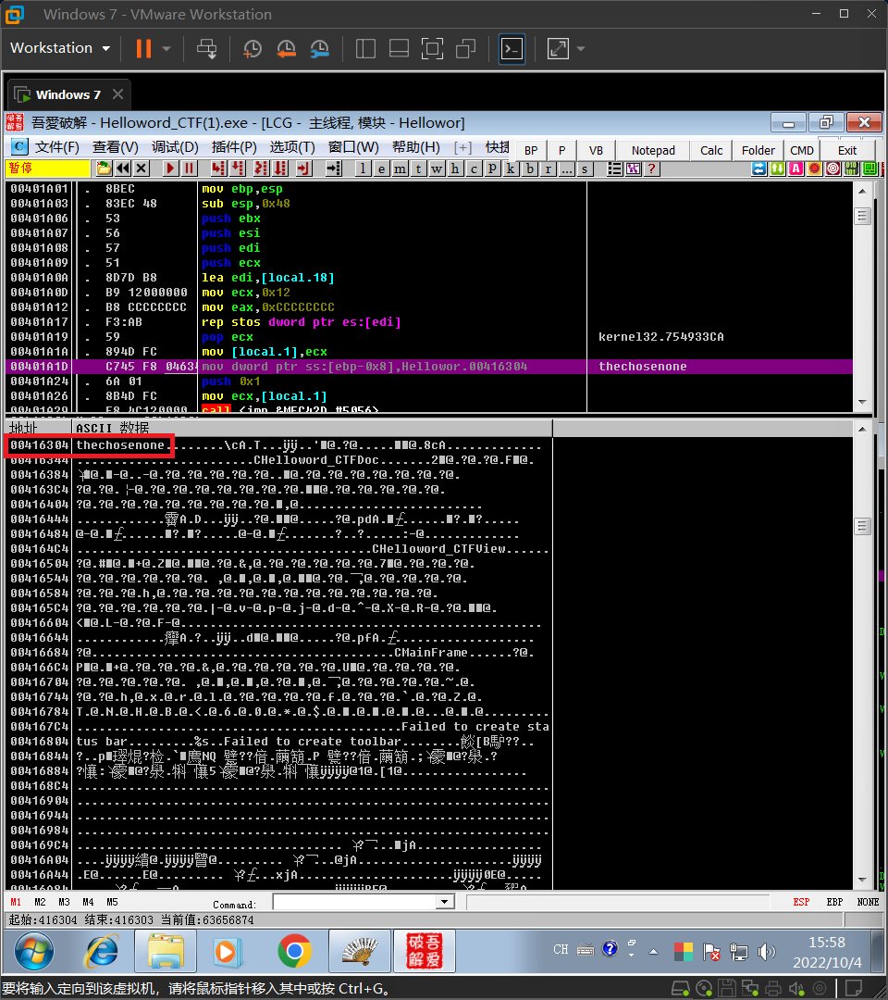

# 实验一

## 实验环境

* VMware Workstation
* Windows 7专业版
* OllyDebug

## 实验过程

### 一、找密码

首先打开`Helloword_CTF.exe`，随意输入密码后，会提示密码错误并且会将错误的密码展示。

使用`OllyDebug`打开需要破解的软件`Helloword_CTF.exe`

根据以上信息使用插件>中文搜索引擎>搜索ASCII，找到相关登录信息和对应的汇编代码

我们将代码跳转到此处，并观察一下登录的逻辑。

通过观察我们可以发现此登录逻辑为：分别将密码和用户输入的密码压入堆栈，然后通过比较这两个值来判断用户输入的密码是否正确。那么就可以知道第一次压入堆栈的`Hellowor.00416304`处存储的数据就是登录密码，即为`thechosenone`。通过验证发现该密码确实如此。

### 二、改逻辑

通过上述的分析我们可以知道，该程序是通过比较两次压入堆栈的值来判断用户输入的密码是否正确。如果这两个值相等，则继续执行代码；如果不等，则跳转到子程序`Hellowor.00401A60`。

那么我们只需要将上述的逻辑反过来，即如果这两个值相等，则跳转到子程序`Hellowor.00401A60`；如果不等，则继续执行代码。

> JNZ：若不等则跳转；如果零标志位Z为0则跳转,即,要求操作的结果非零。
>
> JZ：若相等则跳；如果零标志位Z不为0则跳转,即,要求操作的结果为零。

即将此处的`JNZ`修改为`JZ`即可。

**注：`je`和`jz`的含义相同**

点击左上方的的运行，输入除正确密码以外的密码即可成功登录。

### 三、改密码

根据上文的分析，我们已经知道了密码是存放在地址为`0x416304`的内存中，那么我们只需要修改该内存中的数据就可以实现修改密码了。

在数据窗口中对该内存处的数据进行跟随

那么只需要将此处的数据修改即可，这里我们把它修改为`aaaaaaaaaaaa`。再次点击左上方的运行，进行验证。

我们还是可以发现上述修改密码的还是存在一定问题的，此方法修改后的密码的长度要和原密码的长度相同。

我们将视线再次回到汇编代码，可以发现密码存放的地址是可以修改的，那么我们重新寻找一个内存，把新密码存放在这片内存中，再将这片内存的地址替换原来密码的地址，这样就可以实现随意修改密码了。

将新密码`123`存放在`00416C04 `，再将汇编代码中的地址也修改为此。

再次点击左上角的运行，输入新密码`123`进行验证。

验证成功。