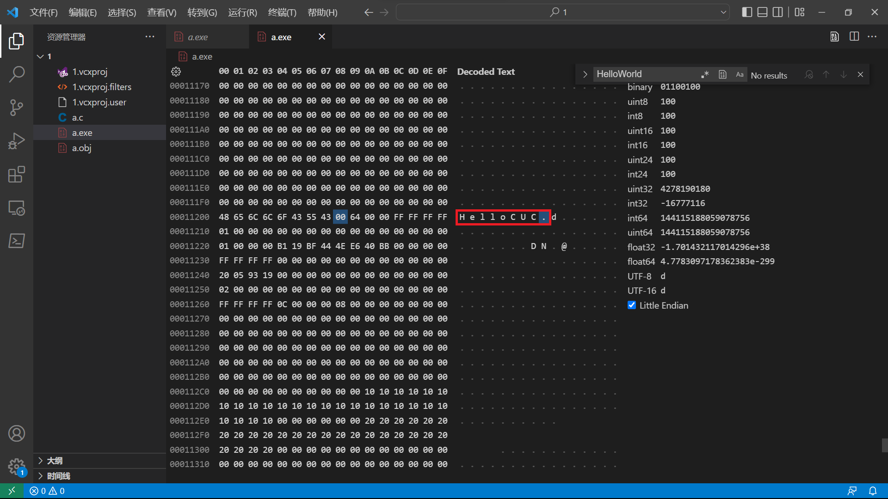

# 命令行编译实验

## 实验环境

* Vistual Studio 2022
* Vistual Studio Code

## 实验目的

* 熟练掌握命令行编译过程
* 熟练掌握汇编过程

## 实验过程

首先使用`Vistual Studio`编写一段C语言代码，其作用是的弹出一个消息框，将其命名为`a.c`

```C
#include<windows.h>

int main() {
	MessageBoxA(NULL, "HelloWorld", NULL, MB_OKCANCEL);
}
```

使用`Vistual Studio`自带的开发者命令提示将该文件进行编译，命令如下

```shell
cl.exe a.c
```

编译之后会生成一个`a.obj`文件，再使用`link`命令就可以生成可执行文件`a.exe`


根据上方的报错可以知道，我们需要找到`MessageBoxA`所依赖的库。我们查询官方文档可以得到，其依赖的库为`User32.lib`


使用命令

```shell
link a.obj User32.lib
```

即可生成`a.exe`文件


紧接着使用`VS code`中的`Hex Editor`打开该可执行程序，并对其进行修改。

我们知道该可执行文件是一个弹窗，并且会显示出`HelloWorld`字样，所以我们查询一下`HelloWorld`。


我们对其进行修改，将其改为`HelloCUC`。



再次打开`a.exe`，就可以看到其输出已经发生改变。


其实该可执行文件所实现的功能是非常简单的，但是该可执行文件竟然有`75KB`，所以我们决定将其缩小，使用命令

```shell
link /entry:mian a.obj User32.lib
```


可以直观地看到，该可执行文件已经由刚才的`75KB`变为了现在的`3KB`。该命令的意思是直接将程序的入口指定到`main`函数。

我们使用`dumpbin`命令来查看汇编代码。使用命令

```shell
dumpbin /disasm a.exe
```


通过之前课程的学习，我们知道`0040100E`是调用了弹出窗口的子函数，`00401003`、`00401005`、`00401007`和`0040100C`是将弹出窗口子函数所需要的参数压入栈中，根据栈"先进后出"的特点，可以知道它是先将后面的参数压入栈。

根据微软的官方文档，可以知道最后一个参数是有关弹出窗口选项的，所以我们对其进行修改


我们将其修改为`0x00000002L`，即将2压入栈中，我们在`VS code`中找到该汇编代码对应的16进制码。


我们将`6A 01`修改为`6A 02`，并保存。再次打开该可执行文件


同样根据之前的课程学习，我们知道`00401007`其实是将`HelloWorld`所对应的地址压入了栈中，所以当我们修改了地址以后，弹出的内容也会随之发生变化，在这里我们就将内存地址向后移两位，观察一下结果。

因为内存地址在栈中是倒序存储的，所以我们只需要将`68 00 30 40 00`修改为`68 02 30 40 00`即可。


## 参考资料

[MessageBoxA function (winuser.h)](https://learn.microsoft.com/en-us/windows/win32/api/winuser/nf-winuser-messageboxa)

[DUMPBIN命令使用详解](https://blog.csdn.net/jamestaosh/article/details/4237756)
