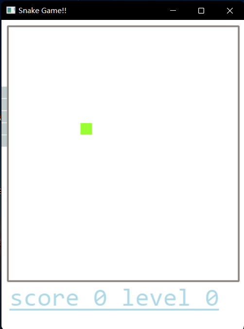

# 实验四 制作简单游戏外挂

## 实验过程

我们通过上节课的学习可以知道，想要在windows系统中出现弹窗，就要使用`MessageBoxA`函数。那么我们基于此，使用`IDA`对贪吃蛇应用进行分析。

使用`IDA`打开贪吃蛇应用后，在`Imports`库中搜索`MessageBoxA`函数


双击此函数，我们就可以看到该函数的详细内容


那么我们此时就可以看到，在这个程序中有两个子函数调用了`MessageBoxA`函数，那么我们分别进入这两个函数中看一看。

首先我们进入子函数`sub_4010B0`中看一看


我们发现这个函数是游戏失败时弹出`Game Over`弹窗的函数，再观察一下另一个子函数`sub_4010B0`，大胆猜测一下，这个函数是游戏胜利时弹出的窗口


果然是游戏胜利时弹出的窗口。

我们观察一下该程序的逻辑，不难发现，该程序在这里做了一次判断


>CMP  EAX, ECX：该指令是比较两个操作数，实际上，它相当于SUB指令，但是相减的结构并不保存到第一个操作数中。只是根据相减的结果来改变零标志位的，当两个操作数相等的时候，零标志位置1。根据标志的值来决定跳转还是不跳转。最简单的例子就是配合JZ指令，如果Z标志被置为1，就跳转，否则，就不跳转。

> JE或者JZ：若相等则跳；如果零标志位Z不为0则跳转,即,要求操作的结果为零

那我们再仔细观察一下此处的汇编指令

```assembly
call    sub_401880
mov     [ebp+var_8], eax
cmp     [ebp+var_8], 1
jz      short loc_4010CF
```

我们知道`eax`寄存器在函数返回时保存函数的返回值，那么大致翻译一下这段指令就是，先调用`sub_401880`函数，然后将该函数的返回值与`1`作比较，如果相同就跳转到游戏失败的子函数。那么我们已经知道了这段指令的大致意思，接下来就是要看看`sub_401880`函数，将他的返回值修改一下就好了。那我们继续看看这个函数，


左边这个函数是将`3`返回到了`eax`中，右边的函数又调用了子函数`sub_401C50`，那我们再看看这个函数


我们可以发现左边和中间的部分是将`1`赋值给了`eax`，右边的使用了异或操作，两个相同的数异或后结果为`0`。

那么至此我们已经清楚了整个程序的逻辑，我们只需要将左边和中间的部分改为将`0`赋值给`eax`就可以了。我们使用`IDA`就可以直接对汇编指令进行修改


我们将两处都修改完成后，将修改后的数据保存，


我们打开应用程序，进行测试



发现此时当贪吃蛇碰到墙壁时也不会发生`Game Over!`。

