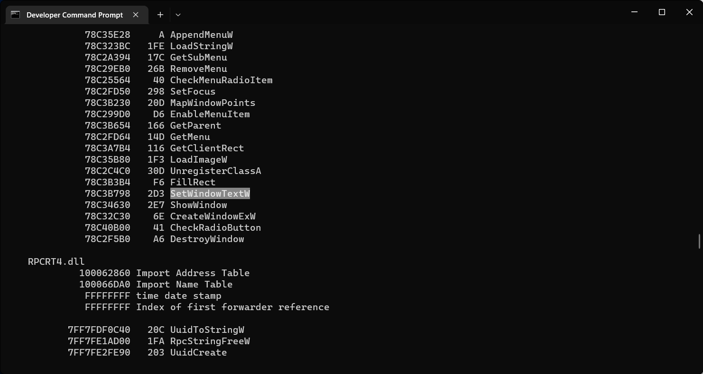
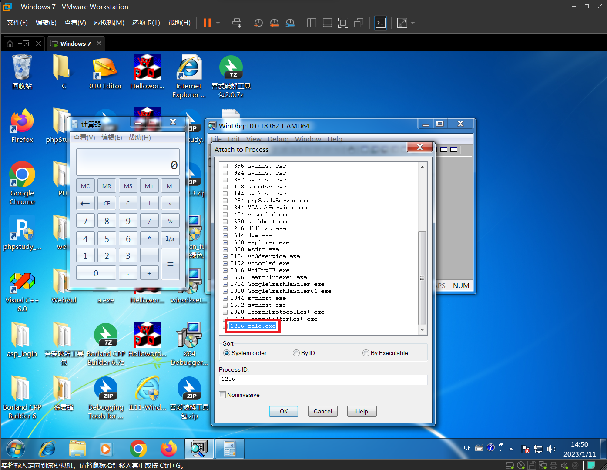
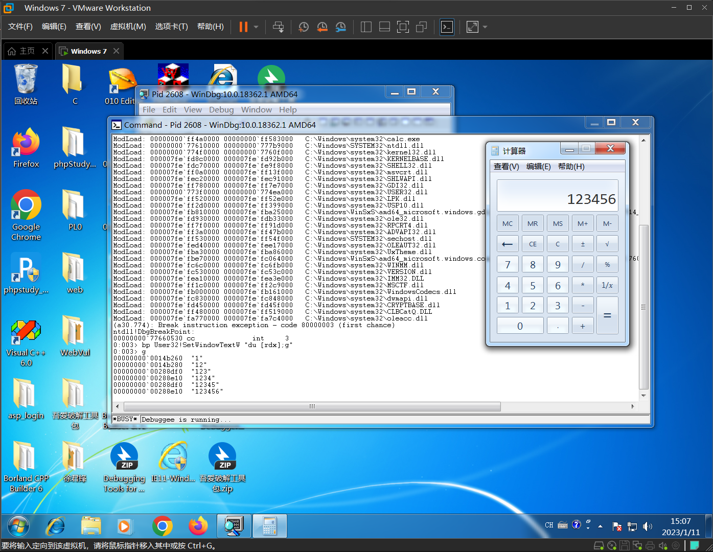
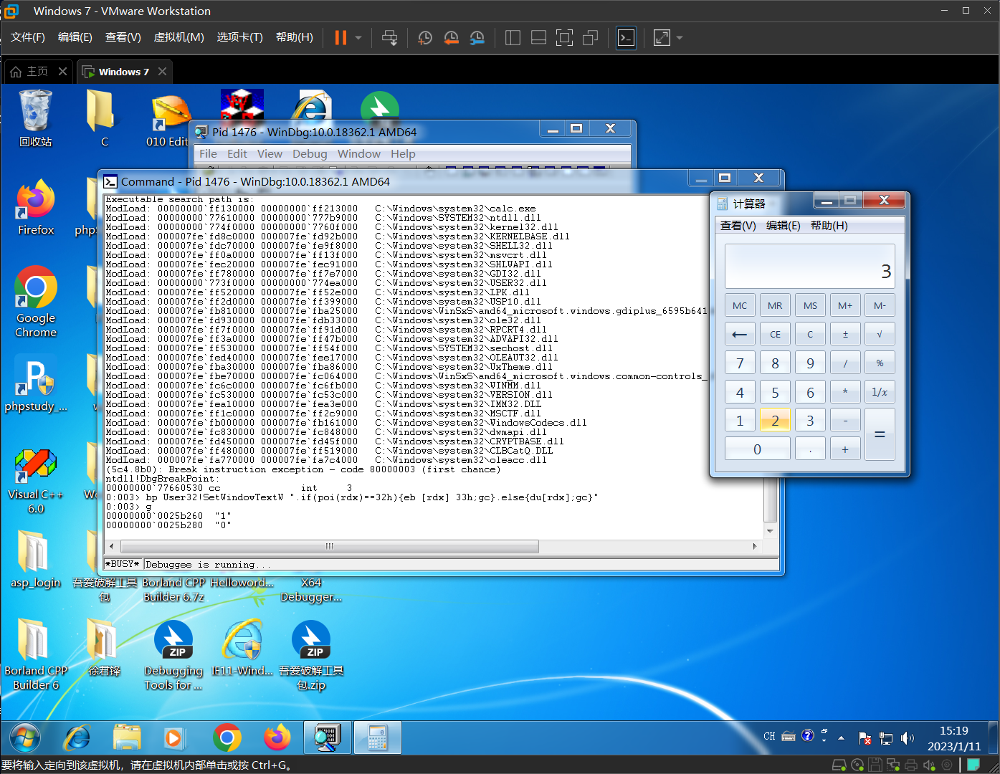
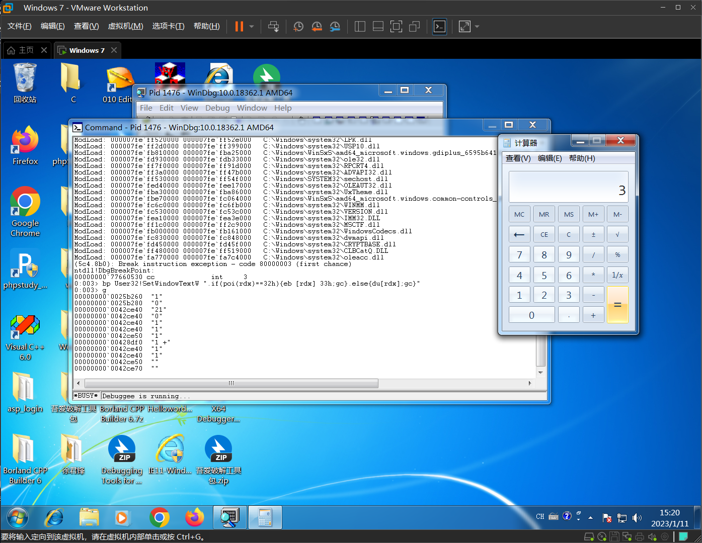

# 使用Windbg修改计算器显示结果

## 实验目的

* 初步掌握windbg的用法
* 初步了解系统API的调用

## 实验环境

* win7 专业版

## 实验过程

首先使用`Visual studio`查看一下导入表，看看计算器中有没有调用`SetWindowTextW`这个函数，这个函数其实也就是这次实验所要`HOOK`的`API`。因为我的win7中没有安装`Visual studio`，所以我就将`calc.exe`拖到宿主机中来查看。因为这个程序已经是编译完成的，所以它的导入表什么的都不会发生改变。



确实有`SetWindowTextW`这个函数，那么接下来我们就对这个函数进行分析，

```c++
BOOL SetWindowTextW(
  [in]           HWND    hWnd,
  [in, optional] LPCWSTR lpString
);
```

`[in] hWnd`

>Type: **HWND**
>
>A handle to the window or control whose text is to be changed.

`[in, optional] lpString`

>Type: **LPCTSTR**
>
>The new title or control text.

之后我们在win7中打开`calc`和`windbg`，点击` File` --> `attach to Process` --> `calc.exe`



接下来我们要设置断点，根据前面查询的导入表，我们知道`SetWindowTextW`这个函数是在`USER32.dll`动态链接库中，`du` 是显示 `Unicode characters` ， `rdx` 则是我们要查看的内容，因为为窗口或控件的新文本是存储在 rdx 中。 `g` 则是继续执行的意思。输入以下指令

```
bp User32!SetWindowTextW "du [rdx];g"
```



可以看到`windbg`也会同步打 印计算器显示的内容。接下来我们需要增加一些附加条件，才能使`2`变为`3`。

`if` 是选择判断语句, `poi()` 是取其中存放的值， `eb` 修改内存地址， `gc` 则是判断语句下的 `g` 指令。通过查询 `ASCii` 表，我们知道 `3` 对应的 `16` 进制 `ASCii` 码是 `33` , `2` 对应的则是 `32` 。我 们要想将 `2` 修改成其他数字，修改至相应的 `ASCii` 码即可。

```
bp User32!SetWindowTextW ".if(poi(rdx)==32h){eb [rdx] 33h;gc}.else{du
[rdx];gc}"
```

输入 `g `开始执行。这个时候，输入 `2 `，结果显示` 3 `。它的原理其实就是在最终显示的时候修改了结果。



输入`1+1`，计算后的结果也为`3`




